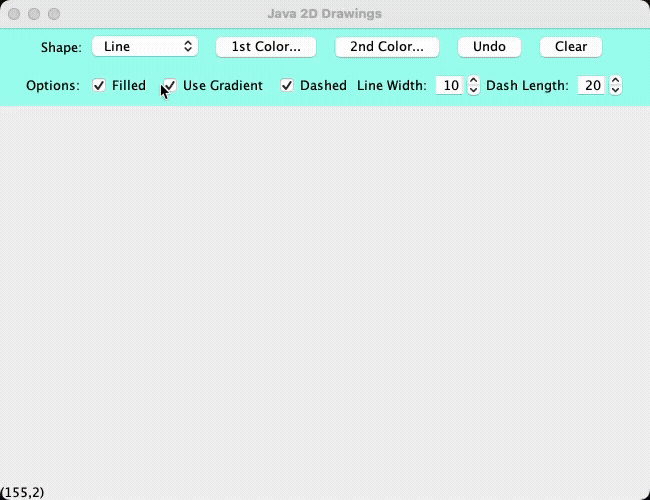
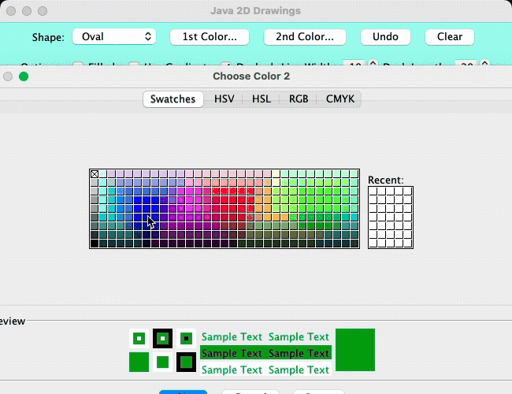

# 🎨 Java 2D Drawing Application

This is a Java Swing-based 2D Drawing Application built using `Graphics2D`, designed for freehand creation of basic shapes like lines, ovals, and rectangles with customizable styles and interactions.

---

## 🛠 Features

-   **Shape Drawing**  
    Draw **Lines**, **Ovals**, and **Rectangles** by selecting from a dropdown menu.

-   **Color Control**  
    Choose a **Primary Color** and **Secondary Color** for each shape.

-   **Styling Options**

    -   Toggle **Gradient Fill** using primary and secondary colors.
    -   Enable **Filled Shapes** for ovals and rectangles.
    -   Add **Dashed Lines**, with adjustable:
        -   **Line Width**
        -   **Dash Length**

-   **Controls**

    -   **Undo**: Remove the most recent shape.
    -   **Clear**: Wipe the entire canvas.

-   **Real-Time Feedback**
    -   Cursor coordinates displayed live at the bottom of the window.
    -   Mouse dragging supported for smooth drawing.

---

## 📁 Project Structure

-   `DrawingApplicationFrame.java` – Main window with all UI logic
-   `DrawPanel.java` – Handles drawing, painting, and user interaction
-   `MyShapes` (and subclasses) – Base class for Line, Rectangle, and Oval
-   `Java2dDrawingApplication.java` – Entry point for launching the app

---

## 📸 Demonstration

**🎥 Drawing Features – Part 1**  

**🎥 Drawing Features – Part 2**  

---

## 📝 Notes

I built this project to deepen my understanding of GUI development in Java. It helped me grasp:

-   Event-driven programming with Swing
-   Real-time drawing with `Graphics2D`
-   Modular shape abstraction and UI/logic separation

---

## 🧠 Let’s Connect!

**Tej Jaideep Patel**  
B.S. Computer Engineering  
📍 Penn State University  
✉️ tejpatelce@gmail.com  
📞 814-826-5544

---
